首先先说一下参考给的文章的原文和代码的地址吧，方便自己去找，还有一些地方自己翻译和理解的不透彻，以及参考的内容
## ORB-SLAM  
原文； &#x1F449; https://ieeexplore.ieee.org/abstract/document/7219438  
代码； &#x1F308; https://github.com/raulmur/ORB_SLAM  
reference： https://mp.weixin.qq.com/s/fHOtW_Y9zlqML4wm6ywifg
https://mp.weixin.qq.com/s/IRdwYRUISgJwEn1hmY8MPA 
### My_understanding（ORB-SLAM） 
### title：ORB-SLAM 一种多用途的并且准确的单目SLAM系统
#### ABstract
这篇文章提出了一种基于***特征点***的单目SLAM（simultaneous localization and mapping）系统，该系统可以实时的工作在大小的室内室外环境。这个系统对剧烈运动有这鲁棒性，，支持宽基线的闭环检测和重定位，以及包含全自动的初始化。这个系统是我们基于近年来的优秀算法从头设计的一个全新的算法，其中包含所有的SLAM系统包含的四个环节tracking、mapping、relocalization、loop closing，选取了最合适的策略来选择点和关键帧，从而使得系统具有很好的鲁棒性，生成稠密的、可追踪的地图。且只有当场景的内容改变时，这个地图内容才增加，因此可以支持长时间的应用。我们选择了通用的图像库中的27场景进行测试。ORB-SLAM呈现了很好的效果。   后面就是吹牛逼了，然后说要开源代码。
#### I. INTRODUCTION
BA（bundle adjustment光束平叉法）因为能用于相机的定位和稀疏的集合地图的构建从而有名，只要给定一个强大的匹配网络和好的初始估计。在较长的一段时间里，这个方法被认为不适合于实时应用，例如VSLAM（visual simultaneous localization and mapping）。VSLAM的目标是在构建环境的同时估计相机的轨迹。现在，我们知道为了能够以较低的计算消耗来得到精确的结果，实时的SLAM系统需要为BA提供如下的信息：  
* 1. 关键帧中场景特征（点云）的观测信息。&#x2753;
* 2. 由于算法的的复杂度随着关键帧的数量增多增长，因此在关键帧的选择中应避免冗余。
* 3. 一个关键帧钰特征点的强大网络配置可以产生准确的定位结果，也就是说，一系列关键帧的观测点要有显著的视差和大量的闭环匹配。
* 4. 为非线性最优化提供关键帧位姿估计和特点位置计算的初值。
* 5. 在局部地图的探索中，最优化的关键的是获得可扩展性。
* 6. 能够快速全局优化来实现实时闭环的能力。  

BA的第一次实时的应用是在Mouragon等人的视觉里程计算法中，其次是在Klein和Murray的开创性SLAM工作，PTAM（parallel track-
ing and mapping）。尽管受限制于小测量的应用，PTAM提供了简单并且有效的算法在关键帧选择，特征匹配，点的三角化，相机每一帧的位姿估计，最终失败后的重定位中。不幸的是，缺少闭环的检测和对遮挡物的处理，视图不变性差，在地图初始化中需要人工的干预，严重限制了PTAM的应用。  
在我们研究中，我们基于PTAM的主要的思想，才用了Gálvez-López和Tardós提出的位置认知（place recognition）的算法，和Strasdat等人提出的尺度感知的闭环检测（the scaleaware loop closing），以及文献7、8中一出的大尺度的合理（covisibility）信息的使用，重新设计了一种新的单目SLAM系统ORB-SLAM，本文的贡献主要包括：  
  1. 对所有的任务采取了相同的特征，tracking、mapping、relocalization、loop closing，这使得我们的系统更有效率、简单可靠。采用的ORB特征，使得在没有GPU加速的状态下能够有很好的实时性，视图不变形和光照不变形。
  2. 在宽阔环境的实时支持。由于合理性地图（covisibility graph）的使用，tracking 和 mapping 集中的局部的可见区域，独立于全局地图。
  3. 使用Essential Graph来优化位姿实现会还检测。并、由系统构建生成树，闭环检测链接，covisibility graph的强边缘来维护。
  4. 算法的实时相机重定位具有明显的旋转不变特性和光照不变性。这使得追踪失败后可以恢复，增强了地图的重用性。
  5. 一种基于模型选择的自动初始化方法，可以对平面和非平面场景创建初始化地图。
  6. 一种合适的方法来选择地图点云和关键帧通过严格删选关键帧和地图点。由于对关键帧的舍弃，这个策略提高了追踪的鲁棒性和长时间的系统操作性。**reference：提出了一种合适的方法来选择地图点云和关键帧，通过严格删选关键帧和地图点，剔除冗余信息，使得特征点的跟踪具备了更好的稳定性，从而增强算法的可持续操作性。好的挑选方法可以增强追踪的鲁棒性，同时舍弃多余的关键帧加强系统长时间操作性。**

我们在公共数据集上对算法的性能在室内和室外环境下进行了评估，包括手提式的设备、汽车、机器人。显著的，与目前最新的SLAM算法相比——直接SLAM方法通过直接对像素点的灰度信息而不是最小化特征重投影误差，我们的方法得到的摄像机的定位精度更加准确。我们在IX-B部分得出了基于特征点的方法比直接方法更加准确的原因。  
闭环检测和冲定位方法是基于我们之前的论文[11]。系统初版的版本是论文[12]。在本文中，我们添加了初始化的方法，Essential graph，和完善了其他的模块。我们还详细的描述了系统的各个模块，并展开了实验的验证。  
据我们所知，这是目前最完整最可靠的单目SLAM系统，为了使更多人获益，我们将源代码开放。视频演示和源代码放在我们的项目网站上。
#### II. Related work
##### A、位置识别
Williams等人在[13]中比较了集中基于景象的位置识别的方法，结果便是，图像到图像的匹配方法，这种发放在发环境中比地图到地图或者是图像到地图的方法更加的准确。在基于外表的方法中，词袋（bags of words）——例如概率方法FAB——MAP算法，由于其效率很高从而脱颖而出。DBoW2方法则首次使用了BRIEF描述子生成的二进制词袋和非常搞笑的FAST特征检测算法。与SURF和SIFT相比用词袋（bags of words）的方法相比，在特征提取方面FAST算法的运时间减小了至少一个数量级。尽管这个系统被论证非常的有效并且鲁棒性好，使用BRIEF描述子没有旋转和尺度不变形，系统只能运行在同一平面内（否则会造成尺度变化），闭环检测也只能从相似的视角中运行。在我们之前的工作中，我们提出了一种使用ORB特征检测子的DBoW2的位置识别器。ORB特征具有旋转不变性和尺度不变形的二进制特性。因此，生成的快速识别具有较好的视角不变形。我们在4中不同得数据集上验证了位置识别功能。从10K图像数据库中提取一个候选闭合回路的运算时间少于39毫秒。在本文的工作中，我们提出了一种改进版本的位置识别方法，采用covisibility信息，在检索数据库时返回几个假设情况而不是最好的匹配。
##### B、地图初始化
#### III、 系统结构（system overview）
##### A、 特征选择
我们系统的主要是设计的思想是对SLAM系统的tracking、mapping、relocalization、loop closing等模块都采用相同的特征，这样将会使得我们的系统更加的有效率并且避免了像以前的文章[5]、[6]一样还需要额外插入一些额外的的识别性强的特征以用于后期的闭环检测。我们每一张图片的特征提取远小于33ms，比目前SIFT算法（~300ms），SURF（~300ms），或者是最近提出的A~KAZE（~100ms）。为了使算法的识别能力更加的通用化，我们需要旋转布标行，而BRIEF和LDB不具有这样的特性。  
我们选择了ORB特征，其具有256位描述符的带方向的多尺度角点。他们计算和匹配的速度非常快。同时具有视角不变性的特性。这样允许我们可以在更宽的基准线上匹配他们，增强了BA的准确性，。我们已经在论文[11]中演示了很好的基于ORB特征的位置识别能力。虽然我们目前的应用是使用ORB方法，但是所提出的技术并不局限于该特征。  
##### B、三个线程tracking、local mapping和loop closing
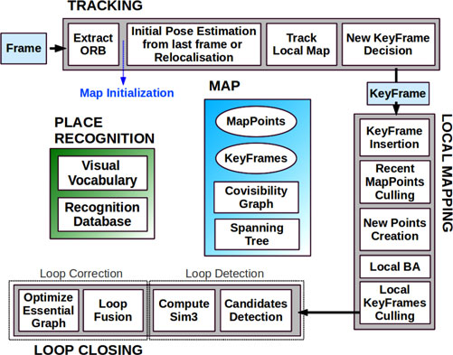  
图1 ORB-SLAM系统框架，图中显示了算法的三个线程——跟踪、局部构图与闭环检测的所有步骤。另外还有场景识别和地图的主要组成部分。  
我们的系统，在图1中可以看到，包括三个并行运行的线程：tracking、local mapping和loop closing。跟踪的线程负责对每帧图像的相机位置进行定位，并决定什么时候插入新的关键帧。我们首先通过与前一帧图相匹配得到初始特征点，然后采用运动BA优化位姿。如果轨迹丢了（比如障碍物阻挡或者是突然运动），则位置识别模块进行全局的冲定位。一旦获得最初的相机位姿估计和特征匹配，则使用系统维护的关键帧的covisibility graph提取一个局部可视化地图 **[如图2(a),2(b)]** 然后用重投影的方法搜索当前帧与局部地图点对应的匹配点，并利用所有的匹配点优化当前的相机位姿。最后tracking线程决定是否需要新的关键帧插入。所有的tracking的步骤将在**第V部分**详细阐述。创建初始化地图的新方法将在**第IV部分**进行说明。  
局部地图构建模块负责处理新的关键帧，对周围的相机位姿进行局部BA优化重构。在convisibility graph已连接的关键帧中搜索新的关键帧中的不相匹配的ORB特征匹配点，然后三角化新的地图点。在创造完新的点云之后。局部地图构建模块也负责删除冗余的关键帧。我们将在第6章详细说明局部地图构建的步骤。  
对每个新的关键帧都要进行闭环搜索，以确认是否形成闭环。如果闭环被侦测到，我们就计算相似变换来查看闭环的累积误差。这样闭环的两端就可以对齐，重复的云点就可以被融合。最后，为了确保全局地图的一致性，利用相似性约束[6]对位姿图进行优化。这里值得一提的是，本文主要对Essential Graph进行优化，它是一个covisibility graph中的一个更稀疏的子图，更多细节将在**III-D**小节描述。闭环检测和校验步骤将在第**VII**部分详细描述。  
我们使用g2o[37]库中的Levenverg-Marquardt算法执行所有的优化。我们在附录中描述了每个优化的误差，计算成本和变量。  
##### C、地图点云、关键帧以及选择的标准
对每个地图点云pi保存以下信息：  
1. 它在世界坐标系中的3D坐标X_w.i 
2. 视图方向n_i，即所有视图方向的平均单位向量（该方向是指连接该点云和其对应观测关键帧光心的射线方向）。
3. ORB特征描述子D_i，与其他所有能观测到该点云的关键帧中ORB描述子相比，该描述子的汉明距离最小。
4. 根据ORB特征尺度不变性约束，可观测的点云的最大距离dmax和最小距离dmin。  
  
对每个关键帧K_i保存以下信息：  
1. 相机位姿T_(i,w)，从世界坐标系转换到相机坐标系下的变换矩阵。
2. 相机内参，包括主点和焦距。
3. 从图像帧提取的所有ORB特征，不管其是否已经关联了地图云点， 这些ORB特征点都经过畸变模型矫正过。
   
一开始，地图点云和关键帧的创建条件较为宽松，但是之后则会通过一个非常严格苛刻的删选机制进行挑选，该机制会检测出冗余的关键帧和匹配错误的或不可跟踪的云点进行删除。这样做的好处在于地图在构建过程中具有一定的弹性，在外界条件比较困难的情况下（比如：旋转，相机快速运动）算法仍然可以实现鲁棒的跟踪，而与此同时，当相机对同一个环境重访问时，地图的尺度大小是可控的,这就利于该系统的长期工作。另外，与PTAM算法相比，我们构建的地图中基本不包含局外点，因为秉持的原则是很苛刻的，宁缺毋滥。地图云点和关键帧的筛选过程将在**VI-B**和**VI—E**分别解释。  
##### Ｄ、Covisibility Graph和Essential Graph
关键帧之间的Covisibility信息在本文的SLAM系统中几个模块上都非常有用，像论文[7]一样，我们将其表示成一个间接的权重图。图中每个节点代表一个关键帧，如果两个关键帧都能同时观测到地图云点中至少15个点，则这两个关键帧之间用一条边线相连，我们用权重θ表示两个关键帧能共同观测到的云点数量。  
为了矫正闭环回路，我们像论文[6]那样做位姿图优化，优化方法延着位姿图将闭环回路的误差进行分散。考虑到covisibility graph可能非常密集的边缘，我们提出构建一个（Essential Graph），该图中保留了covisibility graph的所有节点（关键帧），但是边缘更少，仍旧保持一个强大的网络以获得精确的结果。系统从初始关键帧开始增量式地构建一个生成树，它是一个边缘数量最少的covisibility graph的子图像。当插入新的关键帧时，则判断其与树上的关键帧能共同观测到多少云点，然后将其与共同观测点最多的关键帧相连反之，当一个关键帧通过筛选策略被删除时，系统会重新更新与其相关的连接。Essential Graph包含了一个生成树，一个高covisibility（θmin=100）的covisibility graph边缘子集，以及闭环回路的边缘，这样的组合共同构建了一个强大的相机网络。图2展示了一个covisibility graph，生成树和相关的essential graph的例子。在本文**VIII-E**的实验里，当算法运行位姿图优化时，结果可以达到非常高的精度以至于即便是全局BA优化都很难达到。essential graph的效用和θmin对算法的影响将在**VIII-E**的最后讨论。  
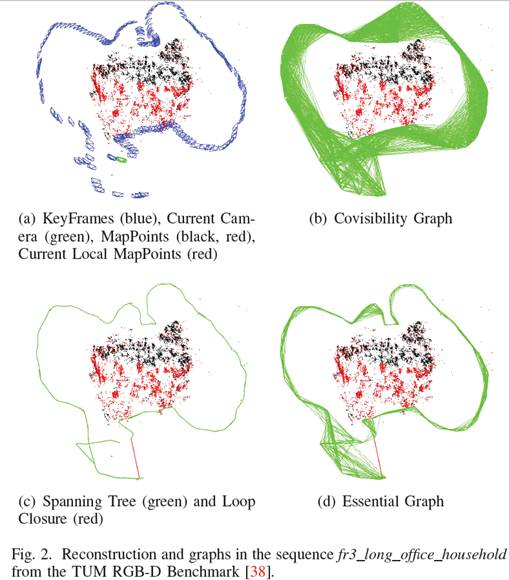  
##### E、基于词袋的位置识别
为了实现闭环检测与重定位，系统嵌入了基于DBoW2[5]算法来执行闭环检测和重定位。视觉词汇（Visual words）是一个离散化的特征描述子空间，被称为视觉词典，这部视觉词典是通过从大量图像中提取ORB描述子离线创建的。如果图像的通用性强，则同一部视觉词典在不同的环境下也能获得很好的性能，正如我们之前的论文[11]那样。SLAM系统增量式地构建一个数据库，该数据库中包含了一个反向指针，用于存储每个视觉词典里的视觉单词，关键帧可以通过这个数据库查询视觉词典，从而实现高效检索。当一个关键帧通过筛选程序删除时，数据库也会相应更新。
##### 考虑了视图重叠的时候，DBow2库原版新版是什么？
由于关键帧之间可能会存在视图上的重叠，因此检索数据库时，可能返回的结果不止一个高分值的关键帧。原版的DBoW2认为是图像重叠的问题，就将时间上接近的图像的分值相加。但这并没有包括观测同一地点但在不同时间插入的关键帧。为了解决这一问题，我们将这些与covisibility graph相连的关键帧进行分类。另外，我们的数据库返回的是分值高于最好分值75%的所有关键帧。  
用词袋模型来表示特征匹配的另外一个优势在论文[5]里有详细介绍。如果我们想计算两个ORB特征的对应关系，我们可以强制匹配视觉字典树上某一层（我们在6层里面选第2层）的相同节点（关键帧）里的特征，这可以加快搜索速度。在本文中，我们就利用这个小技巧来搜索匹配的特征点，用于三角化新的点云，闭环检测和重定位。我们还引入一个方向一致性测试来改进匹配点，具体如论文[11]，这可以去掉无效数据，保证所有对应匹配点的旋转方向一致。
#### IV、地图初始化
地图初始化的目的是计算两帧图像之间的相对位姿来三角化一组初始的地图云点。这个方法应该与场景无关（平面的或一般的）而且不需要人工干预去选择良好的双视图配置，比如两幅图应具有明显的视差。本文算法提出并行计算两个几何模型，一个是面向平面视图的单应矩阵（homography），一个是面向非平面视图的基础矩阵（fundamental matrix)。然后，采用启发式的方法选择模型，并使用所选的模型从两图像的相对位姿中对地图点云进行重构。本文算法只有当两个视图之间的视差达到安全阈值时，才进行地图初始化。如果检测到低视差的情况或已知两视图模糊的情况（如论文[27]所示），则为了避免生成一个有缺陷的地图而推迟初始化。算法的步骤是：  
1. **查找初始的匹配点对：** 从当前帧*Fc*中提取ORB特征（只在最好的尺度上），与参考帧*Fr*搜索匹配点对*Xc——Xr*。如果找不到足够的匹配点对，就重置参考帧。
2. **并行计算两个模型** 在两个线程上并行计算单映矩阵 和基础矩阵：在文献[2]中详细解释了基于RANSAC的归一化DLT算法和8点算法计算原理。为了使两个模型的计算流程尽量一样，将两个模型的迭代循环次数预先设置成一样，，每次迭代的特征点数目也预先设置好，基础矩阵是8个特征点对，单映矩阵是4个特征点对。每次迭代中，我们给每个模型M（H表示单映射，F表示基本矩阵）计算一个分值SM： 
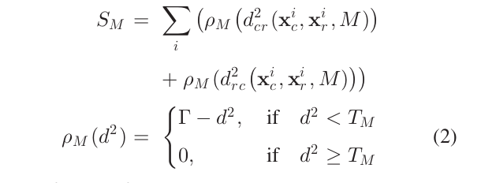  
**&#x2753;其中，dcr2和drc2是帧到帧之间的对称传递误差，其计算方法参见文献[2]。** TM是无效数据的排除阈值，它的依据是X2测试的95%（TH=5.99, TF=3.84，假设在测量误差上有1个像素的标准偏差).tao等于TH，这样两个模型在有效数据上对于同一误差d的分值相同，同样使得运算流程保持一致。  
我们从单映射矩阵和基本矩阵的计算中选择分值最高的，但如果两个模型分值都不高（没有足够的局内点），则算法流程重启，从step1开始重新计算。
3. **模型选择** ：如果场景是平面，近平面或存在低视差的情况，则可以通过单映矩阵来求解。同样地，我们也可以找到一个基础矩阵，但问题是基础矩阵不能够很好的约束该问题[2]，而且从基础矩阵中计算得到的运动结果是错误的。在这种情况下，我们应该选择单映矩阵才能保证地图初始的正确性，或者如果检测到低视差的情况则不进行初始化工作。另一方面，对于非平面场景且有足够的视差的情况则可以通过基础矩阵来计算，而在这种情况下单映矩阵只有基于平面点或者低视差的匹配点才能找到。因此，在这种情况下我们应该选择基础矩阵。我们利用如下强大的启发式进行计算：
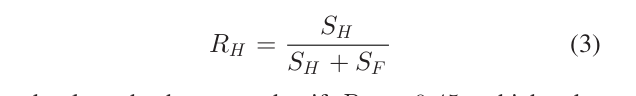  
如果RH>0.45 , 这表示二维平面和低视差的情况，我们将选择计算单应矩阵。其他的情况，我们选择基础矩阵。
4. **运动和从运动到结构的重构：**  一旦选择好模型，我们就可以获得相应的运动状态。如果是单应矩阵（Homography），我们按照Faugeras等人发表的论文[23]中提到的方法，提取8种运动假设，该方法提出用cheriality测试来选择有效解。然而，如果在低视差的情况下，这些测试就会失效，因为云点很容易在相机的前面或后面移动，会导致选解错误。我们提出的方法是直接按这8种解将二维点三角化，然后检查是否有一种解可以使得所有的云点都位于两个相机的前面，且重投影误差较小。如果没有一个明确的解胜出，我们就不执行初始化，重新从第一步开始。这种方法使初始化程序在低视差和两个交叉的视图情况下更具鲁棒性，这也是我们整个算法体现鲁棒性的关键所在。  
在基本矩阵的情况下，我们使用标定矩阵K用下式将其转换为本证矩阵：  
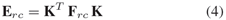  
然后用文献[2]中的奇异值分解方法计算4个运动解，然后就像上文中叙述的一样，我们将四个解用于三角化特征点，以选择正解。
5. **Bundle adjustment:** 最后我们执行一个全局BA，详细优化过程参见附录，以优化初始重构得到的点云地图。  
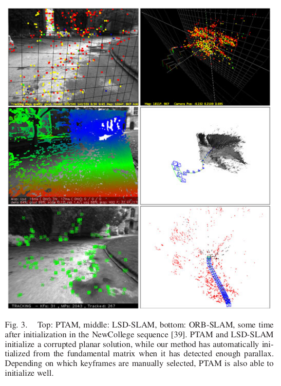    
图3 基于NewCollege图像序列[39]进行地图初始化，最上面一行：PTAM算法,中间一行：LSD-SLAM算法，底下一行：ORB-SLAM算法。其中，PTAM算法和LSD-SLAM算法初始化了一个错误的平面地图，而我们的方法自动选择在两帧图像存在足够视差的情况下再利用基础矩阵初始化。如果人工选择关键帧，则PTAM算法也能够初始化得很好。  
如图3所示是对论文[39]中的室外NewCollege机器人图像序列进行地图初始化的例子，室外环境下初始化工作具有很大挑战性。从图中可以看出，PTAM算法和LSD-SLAM算法对位于同一平面上的所有点都进行了初始化，而我们的方法是当两幅图像有足够视差之后才进行初始化，并基于基础矩阵得到了正确的结果。
#### V、跟踪(tracking,三个线程之一)
在这一部分，我们将详细介绍跟踪线程在相机每帧图像上执行的步骤。在几个步骤中都提到的相机位姿优化，包括运动BA，将在附录部分进行阐述。  
##### A、ORB特征提取
我们在8层图像金字塔上提取FAST角点，金字塔图像尺度因子为1.2。如果图像分辨率从512*384到752*480，我们发现提取1000个角点比较合适，如果分辨率提高，如KITTI数据集[40]，则提取2000个角点。为了确保特征点均匀分布，我们将每层图像分成网格，每格提取至少5个角点。然后检测每格角点，如果角点数量不够，就调整阈值。如果某些单元格内检测不出角点，则其对应提取的角点数量也相应减少。最后，根据保留的FAST的角点计算方向和ORB特征描述子。ORB特征描述子将用于算法后续所有的特征匹配，而不是像PTAM算法中那样根据图像区块的相关性进行搜索。
##### B、通过前一图像帧估计相机的初始位姿
如果上一帧图像跟踪成功，我们就用运动速率恒定模型来预测当前相机的位置（即认为摄像头处于匀速运动）然后搜索上一帧图像中的特征点在地图中的对应云点与当前帧图像的匹配点，最后利用搜索到的匹配点对当前相机的位姿进一步优化。但是，如果没有找到足够的匹配点（比如，运动模型失效，非匀速运动），我们就加大搜索范围，搜索地图云点附近的点在当前帧图像中是否有匹配点，然后通过寻找到的对应匹配点对来优化当前时刻的相机位姿。
##### C、通过全局重定位来初始化位姿
如果扩大了搜索范围还是跟踪不到特征点，（那么运动模型已经失效），则计算当前帧图像的词袋（BoW）向量,并利用BoW词典选取若干关键帧作为备选匹配帧（这样可以加快匹配速度）。然后，在每个备选关键帧中计算与地图云点相对应的ORB特征，就如**III-E**所描述的。接着，对每个备选关键帧轮流执行PnP算法[41]计算当前帧的位姿（RANSAC迭代求解）。如果我们找到一个姿态能涵盖足够多的有效点，则搜索该关键帧对应的更多匹配云点。最后，基于找到的所有匹配点对相机位置进一步优化，如果有效数据足够多，则跟踪程序将持续执行。
##### D、跟踪局部地图
一旦我们获得了初始相机位姿和一组初始特征匹配点，我们就可以将更多的地图云点投影到图像上以寻找更多的匹配点。为了降低大地图的复杂性，我们只映射局部地图。该局部地图包含一组关键帧K1，它们和当前关键帧有共同的地图云点，还包括与关键帧K1在covisibility graph中相邻的一组关键帧K2。这个局部地图中有一个参考关键帧Kref∈K1，它与当前帧具有最多共同的地图云点。现在对K1, K2中可见的每个地图云点，在当前帧中进行如下搜索： 
##### 下面的Why？ &#x2753;
1. 计算地图云点在当前帧图像中的投影点x。如果投影位置超出图像边缘，就将对应的地图云点删除。
2. 计算当前视图射线v和地图云点平均视图方向n的夹角。如果n<cos(60度)，就删除对应云点。
3. 计算地图云点到相机中心的距离d。如果它不在地图云点的尺度不变区间内，即d∉[dmin,dmax]，就删除该云点。
4. 计算每帧图像的尺度比d/dmin。
5. 对比地图云点的特征描述子D和当前帧中还未匹配的ORB特征，在预测的尺度层和靠近x的云点作最优匹配。  

相机位姿最后通过当前帧中获得所有的地图云点进行优化。***（这个环节的目的是在当前帧和局部地图之间找到更多的匹配点对，来优化当前帧的位姿）。***
##### E、新关键帧的判定标准
最后一步是决定当前帧是否可以作为关键帧。由于局部地图构建的过程中有一个机制去筛选冗余的关键帧，所以我们需要尽快地插入新的关键帧以保证跟踪线程对相机的运动更具鲁棒性，尤其是对旋转运动。我们根据以下要求插入新的关键帧：
1. 距离上一次全局重定位后需要超过20帧图像。
2. 局部地图构建处于空闲状态，或距上一个关键帧插入后，已经有超过20帧图像。
3. 当前帧跟踪少于50个地图云点。
4. 当前帧跟踪少于参考关键帧K_ref云点的90%。

与PTAM中用关键帧之间的距离作为判断标准不同，我们加入一个最小的视图变换，如条件4。条件1 确保一个好的重定位，条件3保证好的跟踪。如果局部地图构建处于忙状态（条件2的后半部分）的时候插入关键帧，就会发信号去暂停局部BA，这样就可以尽可能快地去处理新的关键帧。
#### VI、局部地图的构建
这章我们将描述根据每个新的关键帧Ki构建局部地图的步骤。
##### A、关键帧的插入
首先更新covisibility graph，具体包括：添加一个关键帧节点Ki，检查与Ki有共同云点的其他关键帧，用边线连接。然后，更新生成树上与Ki有最多共享点的其他关键帧的链接。计算表示该关键帧的词袋，并利用三角法生成新的地图云点。
##### B、地图点云的筛选
三角化的云点为了已知保留在地图中，必须在其创建后的头三个关键帧中通过一个严格的测试，该测试确保留下的云点都是能被跟踪的，不是由于错误的数据而被三角化的。一个云点必须满足如下条件：
1. 跟踪线程必须在超过25%的图像中找到该特征点。
2. 如果创建地图云点经过了多个关键帧，那么它必须至少是能够被其他3个关键帧观测到。

一旦一个地图云点通过测试，它只能在被少于3个关键帧观测到的情况下移除。这样的情况在关键帧被删除以及局部BA排除异值点的情况下发生。这个策略使得我们的地图包含很少的无效数据。
##### C、新地图的构建
新的地图云点的创建是通过对covisibility graph中连接的关键帧Kc中的ORB特征点进行三角化实现的。对Ki中每个未匹配的ORB特征，我们在其他关键帧的未匹配云点中进行查找，看是否有匹配上的特征点。这个匹配过程在**III-E**中有详细阐述，然后将那些不满足对级约束的匹配点删除。ORB特征点对三角化后，需要对其在摄像头坐标系中的深度信息，视差，重投影误差和尺度一致性进行审查，通过后则将其作为新点插入地图。起初，一个地图云点通过2个关键帧观测，但它在其他关键帧中也有对应匹配点，所以它可以映射到其他相连的关键帧中，搜索算法的细则在本文**V—D**中有讲述。
##### D、局部Bundle Adjustment
局部BA主要对当前处理的关键帧Ki,以及在covisibility graph中与Ki连接的其他关键帧Kc，以及这些关键帧观测到的地图云点进行优化所有其他能够观测到这些云点的关键帧但没有连接Ki的会被保留在优化线程中，但保持不变。优化期间以及优化后，所有被标记为无效的观测数据都会被丢弃，附录有详细的优化细节。
##### E、局部地图选择
为了使重构保持简洁，局部地图构建尽量检测冗余的关键帧，删除它们。这样对BA过程会有很大帮助，因为随着关键帧数量的增加，BA优化的复杂度也随之增加。当算法在同一场景下运行时，关键帧的数量则会控制在一个有限的情况下，只有当场景内容改变了，关键帧的数量才会增加，这样一来，就增加了系统的可持续操作性。如果关键帧Kc中90%的点都可以被其他至少三个关键帧同时观测到，那认为Kc的存在是冗余的，我们则将其删除。尺度条件保证了地图点以最准确的方式保持它们对应的关键帧。（这句翻译没理解透：The scale condition ensures that map points maintain keyframes from which they are measured with most accuracy.）这个策略受Tan等人的工作[24]的启发，在这项工作中，作者在经过一系列变化检测后即将关键帧删除。

#### VII、闭环检测
闭环检测线程抽取Ki——最后一帧局部地图关键帧，用于检测和闭合回环。具体步骤如下：
##### A、Loop candidates Detection（候选回环检测？？）
我们先计算Ki的词袋向量和它在covisibility graph中相邻图像（θmin=30）的相似度，保留最低分值Smin。然后，我们检索图像识别数据库，丢掉那些分值低于Smin的关键帧。这和DBoW2中均值化分值的操作类似，可以获得好的鲁棒性，DBoW2中计算的是前一帧图像，而我们是使用的covisibility信息。另外，所有连接到Ki的关键帧都会从结果中删除。为了能够获得Loop candidates（候选回环？？），我们必须检测3个一致的候选回环（covisibility graph中相连的关键帧）。如果对Ki来说环境样子都差不多，就可能有几个候选回环。
##### B、计算转换信息的相似度
单目SLAM系统有7个自由度，3个平移，3个旋转，1个尺度因子 [6]。因此，闭合回环，我们需要计算从当前关键帧Ki到回环关键帧Kl的相似变换，以获得回环的累积误差。计算相似变换也可以作为回环的几何验证。  
我们先计算ORB特征关联的当前关键帧的地图云点和回环候选关键帧的对应关系，具体步骤如**III-E**所示。此时，我们有了一个3D到3D的对应关系。我们对每个候选回环执行RANSAC迭代，通过Horn方法（如论文[42]）找到相似变换。如果我们用足够的有效数据找到相似变换Sil，我们就可以优化它，并搜索更多的对应关系。如果Sil有足够的有效数据，我们再优化它，直到Kl回环被接受。
##### C、回环融合
回环矫正的第一步是融合重复的地图云点，在covisibility graph中插入与回环相关的的新边缘。先通过相似变换Sil矫正当前关键帧位姿Tiw，这种矫正方法应用于所有与Ki相邻的关键帧，这样回环两端就可以对齐。回环关键帧及其近邻能观测到的所有地图云点都映射到Ki及其近邻中，并在映射的区域附近小范围内搜索它的对应匹配点，如**V-D**所述。所有匹配的地图云点和计算Sil过程中的有效数据进行融合。融合过程中所有的关键帧将会更新它们在covisibility graph中的边缘，创建的新边缘将用于回环检测。
##### D、Essential Graph优化
为了有效地闭合回环，我们通过Essential Graph优化位姿图，如**III-D**部分所示，这样可以将回环闭合的误差分散到图像中去。优化程序通过相似变换校正尺度偏移[6]。误差和成本计算如***附录***所示。优化过后，每一个地图云点都根据关键帧的校正进行变换。
#### VIII、实验部分
我们采用NewCollege[39]的大场景机器人图像序列对本文提出的系统进行了较全面的实验评估，首先采用TUM的室内16个手持RGB-D数据集[38]对系统的总体性能进行了评估，包括算法的定位精度，重定位和程序运行能力；然后，用KITTI的10个汽车户外图像数据集[40]，评估算法在实时大场景下的操作及其定位精度和位姿图的优化效率。  
***这一段就是说的是配置啥的略过了。***  
##### A、基于Newcollege数据集测试系统性能
NewCollege数据集[39]包含了一个2.2公里的校园的机器人图像序列。它是由双目相机拍摄，帧率为20fps，分辨率512x38。图像序列中包含几个回环和快速的旋转，这对单目视觉定位非常具有挑战性。我们所知，目前没有单目系统可以处理整个图像序列。例如论文[7]，尽管其算法可以实现回环检测，也可以应用于大场景环境，但只有小部分序列图像能够显示单目结果。  
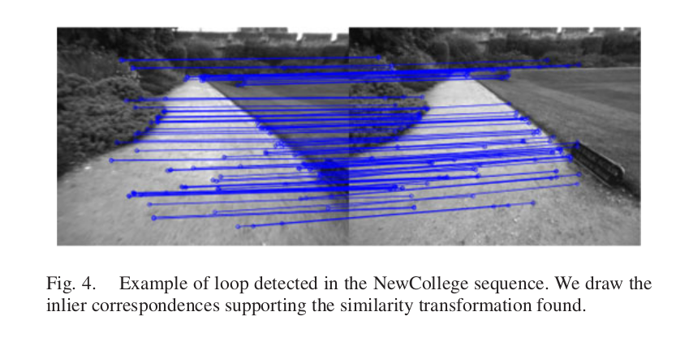  
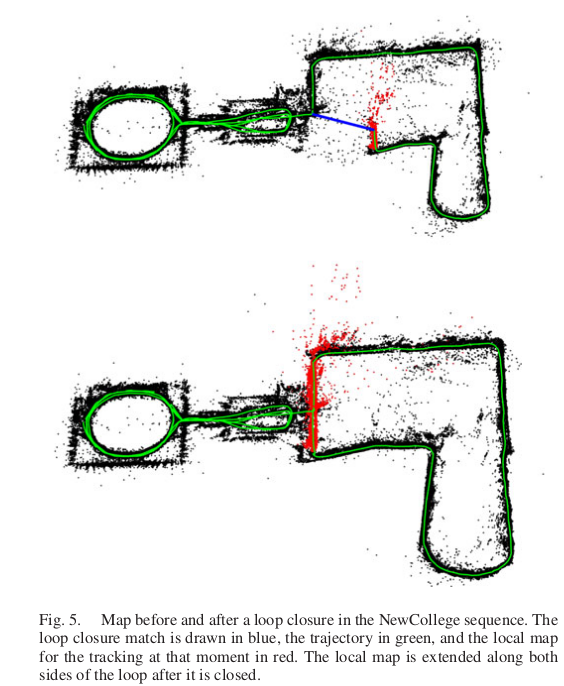  
如图4显示的是我们的算法检测到的闭合回路，在图中，我们选择的有效数据点都支持相似性变换（similarity transformation）。图5则对比了回环闭合前后的环境地图重构状况。其中，红色表示的是局部地图，回环检测后可以看到其两端扩展到连接整个运行轨迹。图6是以实时帧率速度运行整个图像序列后的全局地图，从图中可以看出，后边的大回环并没有完全闭合，它从另外一个方向穿过，位置识别程序没能发现闭合回路。  
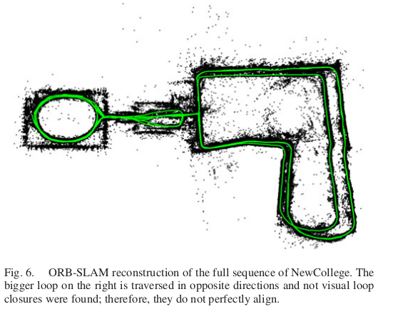  
我们统计了ORB_SLAM算法每个线程所用的时间。**下图的表I**显示了tracking和local mapping的时间。可以看出，跟踪的帧率大概在25-30Hz，这是跟踪局部地图(Track local Map)所需的最多时间。如果需要的话，这个时间还可以更快，只要减少局部地图中所包含的关键帧数量即可。局部地图构建线程中需时最高的是局部BA优化。局部BA的时间根据机器人探索环境的状态变动，即在未探索环境下所需时间多，在已经探索过的环境下运行所需时间少，因为在未知环境中如果跟踪线程插入一个新的关键帧，BA优化会被中断，**第V-E部分**所示。如果不需要插入新的关键帧，局部BA优化则会执行大量已经设置的迭代程序。  
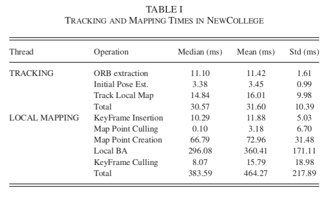  
下面的表二显示了6个闭合回路的结果。可以看到回环检测是如何 **亚线性（这是个What？)** 地随关键帧数量的增多而增加。这主要是由于高效的数据库检索,只比较了具有相同图像单词的图像子集，由此可见用于位置识别词袋模型的潜力。我们的Essential Graoh中包含的边缘是关键帧数量的5倍，它是一个稀疏图。  
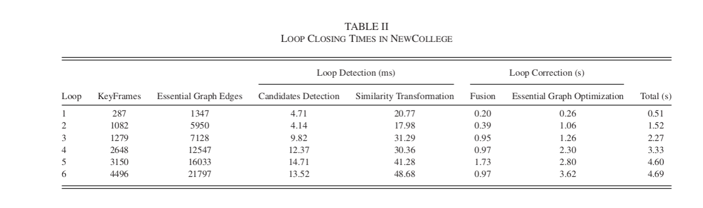  
##### B、基于TUM RGB-D标准库的定位精度
TUM RGB-D数据集[38]是一个用于估计摄像头定位精度的优秀数据库，它提供了许多图像序列，还包括外部运动捕捉系统提供的对应轨迹真值。我们去掉那些不适合纯单目SLAM系统的图像序列，这些序列包含强烈的旋转，没有纹理或没有运动。  
为了验证算法性能，我们选择了最近提出的直接法半稠密LSD-SLAM（论文[10]）和经典算法PTAM（论文[4]）作为对比。  除此之外，我们还比较了由RGBD-SLAM（论文[43]）算法生成的轨迹。。为了在相同的基准下比较ORB-SLAM，LSD-SLAM和PTAM，我们用相似变换对齐关键帧轨迹，在尺度未知的情况下，检测轨迹的绝对误差（论文[38]）。对RGBD-SLAM算法，我们通过相机坐标变换来对齐轨迹，也采用同样的方法检测尺度是否重构良好。LSD-SLAM从随机深度值开始初始化，然后随机值逐渐收敛，因此与基准对比的时候，我们会丢掉前10个关键帧。对于PTAM算法，我们从一个好的初始化中，手动选择两个关键帧。**下图的表3** 是对我们选择的16个图像序列运行5次的中间结果。  
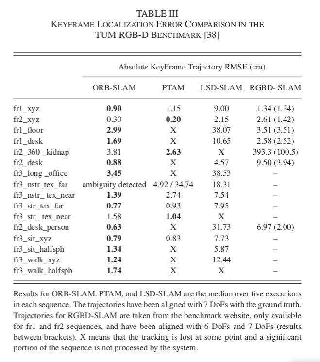  
##### RMSE一般指的是均方根误差  
从表中可以看出，ORB-SLAM可以处理所有的图像序列，除了fr3 nostructure texture far (fr3 nstr tex far)以外。这是一个平面的场景，相机的轨迹在这种情况下有两种可能，正如论文[27]中的描述的。我们的初始化方法检测到这种模棱两可的情况，为了保证算法的安全运行选择不进行初始化。PTAM初始化有时会选择对的方案，有些可能会选择错的方案，且导致的错误可能不能接受。我们没有注意到LSD-SLAM的2种不同的重构方案，但在这个图像序列出现的错误非常多。针对其他的图像序列，PTAM和LSD-SLAM算法的鲁棒性都比我们的方法差，且分别有八组序列和三组序列中地图点容易跟踪丢失。  
关于精度问题，没有回环检测期间，ORB-SLAM和PTAM算法的定位精度相当，但回环检测成功后，ORB-SLAM算法将达到更高的定位精度，正如在图像序列fr3 nostructure texture near withloop (fr3 nstr tex near)中表现的。非常意外的一个结果是PTAM和ORB-SLAM都非常明显地表现出精度高于LSD-SLAM和RGBD-SLAM。一个可能的原因是它们将地图的优化过程简化为一个单纯的姿态图优化过程，这样就造成了传感器测量信息的丢失，但在我们的算法中，采用BA优化，同时通过传感器测量优化相机的姿态和地图的云点位置，这是解决运动到结构[2]的经典标准算法。我们将在**第IX-B部分**进一步讨论了这个结果。另一个有趣的结果是在图像序列fr2 desk with person 和 fr3 walking xyz中，LSD-SLAM对动态物体的鲁棒性相比ORB-SLAM差一些。  
我们注意到RGBD-SLAM在图像序列fr2上尺度上有一个偏差，用7自由度对齐轨迹则误差明显减少。最后我们注意到Engle等人在论文[10]中提出在f2_xyz上PTAM的精度比LSD-SLAM算法低，RMSE是24.28cm。然而，论文没有给出足够的细节说明如何获得这些结果的，因此我们没有办法复现它。
##### C、基于TUM RGB-D标准数据库的重定位
我们在TUM RGB-D数据集上进行了两组重定位实验。在第一个实验中，我们选择fr2_xyz图像序列，通过前30秒构建了一个地图，然后对后来的每一帧图像都进行全局重定位，并评估重构出来的相机位姿精度。我们对PTAM算法进行了相同的实验。如图7所示是创建初始地图的关键帧，重定位的图像帧位姿和这些帧对应的真值。从图中可以看出PTAM算法只能够对重定位关键帧附近的图像帧，这是因为其算法中重定位方法并不具备不变形导致的。**下图的表IV** 显示了PTAM算法和ORB_SLAM算法相对地面真值的误差。ORB-SLAM比PTAM可以更精准地多定位2倍的图像帧。  
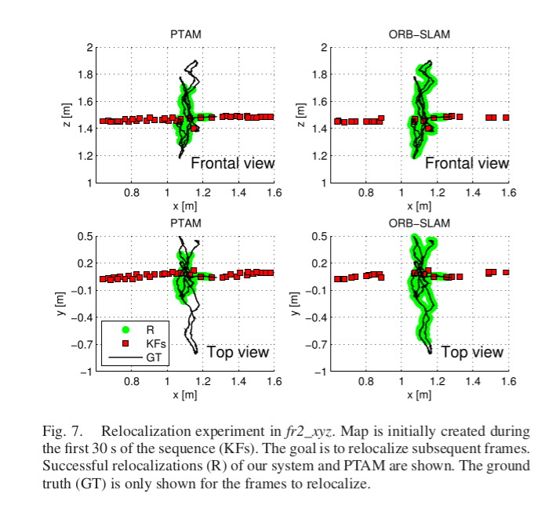    
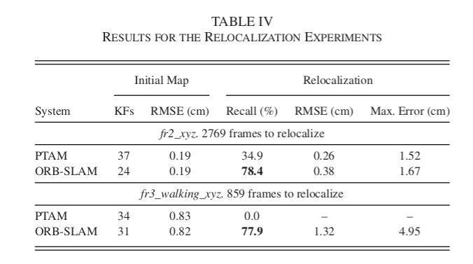  
第2个实验中，我们采用fr3_sitting_xyz图像序列来初始化地图，然后用fr3_walking_xyz图像序列重定位所有的图像帧。这是一个颇具挑战性的实验，由于图像中有人移动，会造成图像局部区域的遮挡。在该试验中，PTAM并没有实现重定位，而ORB-SLAM重定位了78%的图像帧，如表4所示。下面图8显示了ORB-SLAM重定位的一些实验图例。  
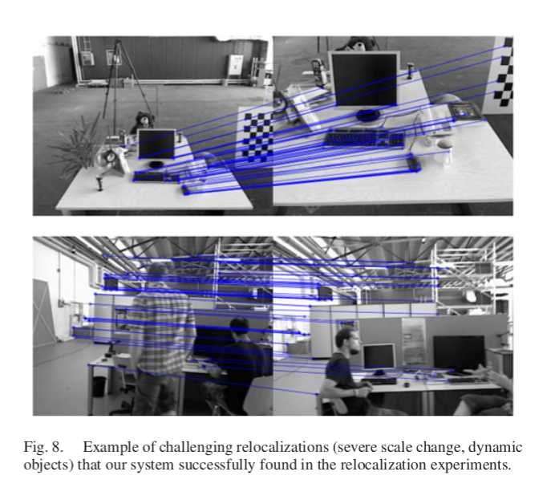  
##### D、基于TUM RGB-D标准数据集测试算法的运行生命
之前的重定位实验表明我们的系统可以从非常不同的视角定位地图，在中等动态环境中的鲁棒性也较好。这个特性和关键帧筛选程序使得算法在不同的视角和局部动态环境中能够一直运行到图像结束。  
在全静态场景情况下，即使相机从不同视角观测场景，ORB-SLAM也可以使关键帧数量保持在一个有限的水平内。我们在一个自定义的图像序列中验证了这一点，手持相机在93秒以内都拍摄同一张桌子，但视角一直变换，形成一个轨迹。我们对比了我们地图的关键帧数量和PTAM生成的关键帧，如图9所示。可以看到PTAM一直都在插入关键帧，而ORB-SLAM会删除冗余的关键帧，将其总数保持在一个稳定的范围内。  
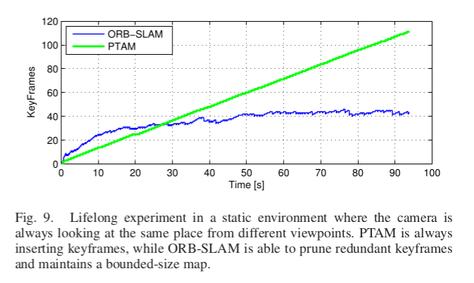  
当然，在整个程序运行过程中，静态环境下的正常操作是任何SLAM系统的一个基本要求，更引人关注的是动态环境下的状况。我们在几个fr3的图像序列中分析了ORB-SLAM系统的状况，图像序列有：sitting xyz, sitting halfsphere, sitting rpy, walking xyz, walking halfspehere 和walking rpy。所有的视频中，相机都对着桌子，但运动轨迹不同，拍摄场景中有人在移动，椅子也被移动了。如图10（a）所示是ORB_SLAM算法生成的地图中所有关键帧的总数量，图10（b）显示从图像帧中创建或删除关键帧，从中可以看出从关键帧到地图构建需要多久时间。可以看到前2个图像序列中新看到（增加）场景时地图的大小一直在增加。图10（b）是前2个视频中创建的关键帧。在视频sitting_rpy和walking_xyz中，地图没有增加，地图是通过已有场景创建。相反，在最后两个视频中，有更多的关键帧插入但没有在场景中表示出来，可能由于场景的动态变化。图10（C）是关键帧的柱状图，它们是从视频中挑选出来的。大部分的关键帧被筛选程序删除了，只有一小部分留下来了。ORB-SLAM有大量关键帧的生成策略，在未知环境下非常有用；后面系统会生成一个小的子集来代表这些关键帧。  
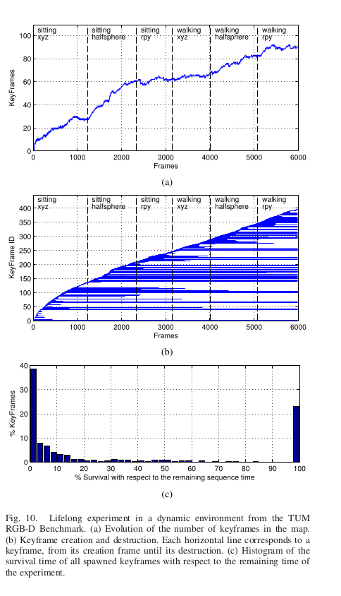  
在整个实验中，我们系统的地图根据场景上内容来增加，而不是根据时间，它可以存储场景的动态变化，通过积累经验在场景的理解中非常有用。  
##### E、基于KITTI数据集测试算法在大场景大回环下的性能对比
KITTI数据集中[40]里程计的数据包括11个视频，它的获取是在一个住宅区驾驶汽车，基准精度非常高，有一个GPS和一个Velodyne Laser Scanner.这个数据集对单目系统非常有挑战性，因为视频中有快速旋转，区域内有大量树叶，这使数据关联变得更困难，而且车速相对较快，视频记录的频率为10fps。视频01外，ORB-SLAM可以处理其他所有的视频，01是高速路上的视频，可追踪的物体非常少。视频00,02,05,06,07,09，有闭环回路，系统可以检测到，并使它闭合。其中视频09的闭环只能在视频的最后几个图像帧里检测到，并不是每次都能成功检测到（结果显示的是针对其被检测到的运行情况）。  
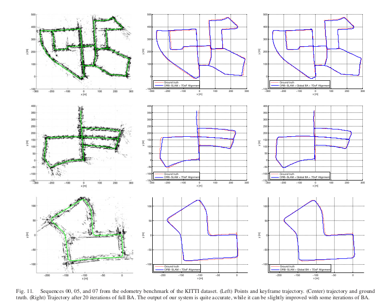  
对于轨迹与基准的定性比较如**上图11**和**下图12**所示。TUM RGB-D数据集中，我们可以通过相似变换对齐轨迹的关键帧和基准。图11是定性比较的结果，图12是论文[25]中的最新单目SLAM在视频00,05,06,07和08上执行的结果。除了08有一些偏移以外，ORB-SLAM在这些视频上的轨迹都很精准。  
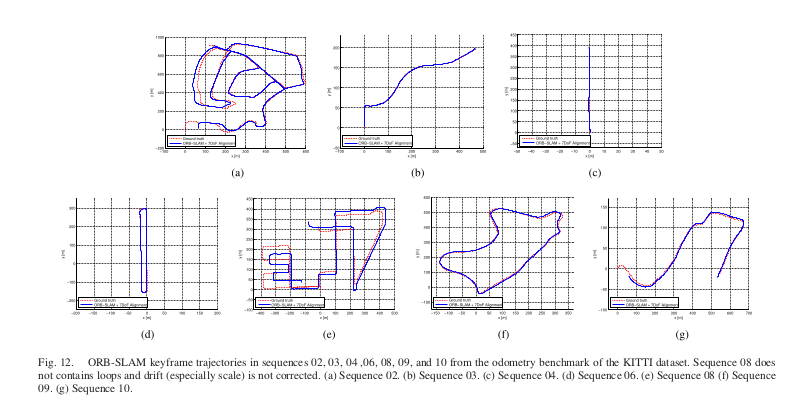  
**下图的表V**显示了每个视频的关键帧轨迹中间的RMSE误差。我们基于地图尺寸提供了轨迹的误差。结果表明我们的轨迹误差是地图尺寸的1%左右。大致范围低的是视频03的0.3%高的是视频08的5%。视频08中没有闭环，漂移也没办法纠正，因为闭环控制需要获得更精确的重构。
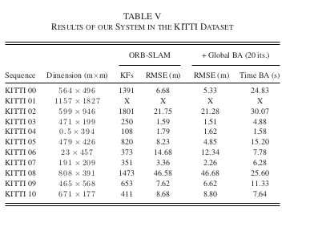  
在本次实验中，我们还确认了到底全局BA的20层迭代最终能优化多少地图重构(相关的细节看附录)。我们还注意到全局BA优化可以稍微增加闭环轨迹的精度，但这对开环轨迹有负面影响，这意味着我们的系统已经非常精确了。在有些应用中，如果需要非常精确的结果我们的算法会提供一组匹配，需要定义一个比较强的相机网络，一个初始估计，这样全局BA优化迭代次数就会变少。  
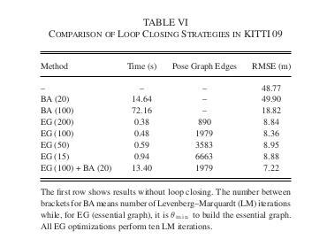  
最后讲一下我们算法的闭环检测和用于essential graph边缘的θmin的效率。我们选择视频09（一段非常长的图像序列，在最后有一个闭环），然后评估不同的闭环检测算法。**上图的表VI**是关键帧轨迹RMSE和不同情况下没有闭环检测优化所用的时间，如果直接采用全局BA优化（20层或100层迭代）的情况，如果只用位姿图优化（10层迭代不同数量的边缘）的情况，如果先用位姿图优化再执行全局BA优化的情况。**下图的图13**表示了不同算法的不同结果。结果表明，在闭环检测之前，算法的RMSE误差较大，以至于BA优化没办法收敛，即便是迭代100次之后后误差仍旧非常大。另一方面，essential graph优化收敛速度很快，而且结果也更精确。θmin对精度影响并不大，减少边缘的数量时间会明显减少。。位姿图优化后再执行一个BA优化则可以增加精度，但时间也增加了。  
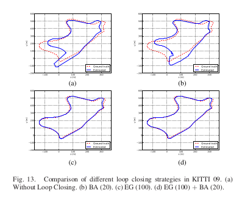  
#### IX、结论和讨论
##### A、结论
本文中，我们提出了一个新的单目SLAM系统，并详细介绍了其组成模块，最后基于公共数据库对其性能进行了全方位的测试。通过实验得知，我们的系统可以处理室内与室外的图像序列，能够用于汽车、机器人和手持设备上。其定位精度在室内小场景中约为1厘米，室外大场景的应用是几米（前提是我们与真实轨迹尺度对齐的情况下）。  
由Klein和Murray[4]提出的PTAM算法被认为是目前最精准的单目实时SLAM方法。PTAM后端是BA优化，这是众所周知的离线SFM（从运动到结构Structure From Motion）问题[2]的经典解法。PTAM算法和Mouragnon[3]早期作品的主要贡献是将BA算法引入到机器人SLAM框架下，并具有良好的实时性。而本文的主要贡献是将PTAM算法的适用性进一步扩展，使其可以应用于原来不可应用的场景下。了实现这一目标，我们整合了前面几年的优秀作品，引入新的想法和算法，从头设计了一种新的单目SALM系统所用到的技术包括Gálvez-López和Tardós提出的论文[5]中的闭环检测，Strasdat等人在论文[6],[7]中提出的的闭环检测程序和covisibility graph，Kuemmerle等人在论文[37]中提出的g2o优化框架以及Rubble等人提出的ORB特征[9]。到目前为止就我们所知，本文提出的ORB_SLAM方法的定位精度最高，也是最可靠最完整的单目SLAM系统。我们提出的新的生成和删除关键帧策略，允许每个几帧就创建一个关键帧，然后当关键帧冗余时则删除。这样的构图方式很灵活，在外界条件很差的情况下可以保证系统正常运行，比如相机作纯旋转运动或快速移动时。当算法在相同场景下运行时，地图在只有拍摄到新内容的情况下才会增长，可以从我们的长期构图结果中看到这个特性。  
最后，我们还展示了ORB特征具有很好的识别能力，可识别剧烈视角变换情况下的场景信息。此外，它们能够被非常快速的提取和匹配（不需要多线程或GPU加速），这就使得跟踪和地图构建更加实时精确。
###### B、离散/特征SLAM方法与稠密/直接SLAM方法对比
最近，DTAM[44]和LSD-SLAM[10]提出了一种实时单目SALM算法，算法直接利用图像像素的亮度信息进行摄像头的定位与优化，并重构稠密或半稠密的环境地图。这类方法即为直接法，直接方法不需要特征提取，可以避免人工匹配。他们对图像模糊，弱纹理环境和像论文[45]这样的高频纹理环境的鲁棒性更好。与由稀疏点构建的地图相比，比如ORB-SLAM或PTAM算法，稠密/直接法SLAM对相机定位之外的其他应用任务可能更有用途。  
然而，直接方法有他们自己的局限。首先，这些方法假设真实场景中的物体的像是由该物体本身的表面反射模型产生的，因此，算法采用的光度一致性寻找匹配点的思路就限制了匹配点之间的基线距离，通常都比特征匹配点的基线要窄。这对重构的精度影响很大，因为重构需要较宽的基线来减少深度的不确定性。如果直接建模不准确，则可能会受到快门，自动增益和自动曝光的影响（如TUM RGB-D 的对比测试）。最后，由于直接方法计算要求较高，因此为了满足计算速度，DTAM算法采用地图增量式扩张的方法，而LSD-SLAM则丢掉传感器测量信息，将地图优化降低为对位姿图的优化。  
相反，基于特征的方法可以在更宽的基线上匹配特征，主要得益于特征匹配算法较好地视图不变特性。BA优化和相机位姿优化，地图云点通过传感器测量进行融合。在运动结构估计中，Torr和Zisserman[46]已经指出了基于特征的方法相比直接方法的优势。在我们的实验**第VIII-B部分**中也直接提供了证据，表明基于特征的定位精度更高。未来单目SLAM应该会整合两种最好的方法。
##### C、未来展望
我们系统的精度可以通过结合无限远点跟踪来进一步增强。这些在视图中看不到的平行线交点，并没有包含在本文算法构建的地图中，但对相机的旋转非常有用[21]。  
另外一种方法是将稀疏地图更新到一个更加稠密的地图。由于我们关键帧的选择机制，关键帧组成了一个紧凑的地图，地图具有非常高精度的位姿信息和丰富的covisibility信息。所以，ORB-SLAM稀疏地图是一个非常优秀的初始估计框架，比稠密地图更好。这个方向的首次尝试在论文[47]中有详细描述。